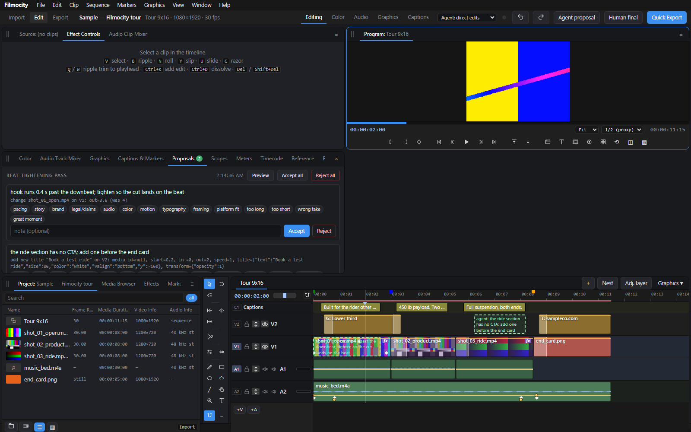
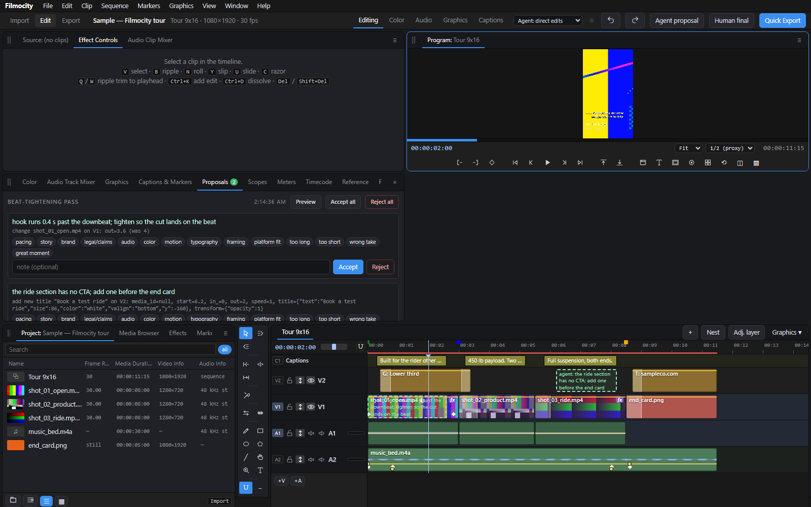

# Filmocity v0.44 — the workstation's video editor

> **`docs/SPEC_AUDIT.md`** is the executable specification audit (69 checks against code, assets and a running server, regenerated by `tests/test_spec.py`); **`docs/PLAYBOOK.md`** is the ten-minute path through the whole system for an ad; **`docs/FEATURES.md`** is the one-page account of everything Filmocity does; `docs/AUDIT.md` maps it to Premiere Pro menu by menu; `docs/GAPS.md` is what is still thin.

**Status:** v0.44 · Python 3.10+ · runs entirely on your machine — a local server on `localhost:8787`, no account, no telemetry; the installer's only downloads are a static FFmpeg build (and faster-whisper, if you opt in for auto-captions). Known gaps are listed honestly in `docs/GAPS.md` and [Parity status](#parity-status). MIT.

Filmocity is the video half of a two-app pipeline: its sibling [pictocity](https://github.com/SlightSignal/pictocity) is the Photoshop-style still/layered-ad editor, built on the same idea — one document, human and agent editing it through the same operations, every change attributed and reversible. `docs/AGENT_API.md` + `docs/PLAYBOOK.md` are the agent playbook for this app.

*An agent's pending proposals: each carries its reason, you accept or reject one by one (with reason codes that train the advisor), and the proposed change shows as a dashed ghost on the timeline before you decide.*

A non-linear editor built to feel like Premiere Pro for someone who already lives in it — the same Editing-workspace layout (Source dock with Effect Controls and Audio Clip Mixer tabs · Program Monitor · Project dock with Effects, History and Info · tools column · timeline), the same menu structure (File · Edit · Clip · Sequence · Markers · Graphics · View · Window · Help), the same default shortcuts, source patching and track targeting, sync lock, Type tool, Effects panel you double-click to apply, workspaces (Editing / Color / Audio / Graphics / Captions) with a right dock — built so the agent and the human cut on the **same open project file**, every edit is logged with who did it and why, the agent can *propose* edits you accept or reject one by one, and the gap between "what the agent proposed" and "what you shipped" becomes training data. Filmocity is an independent project: it borrows Premiere's conventions so your muscle memory transfers, not Adobe's code, icons or assets (Premiere Pro is a trademark of Adobe Inc.). Runs locally; nothing leaves the machine.

## One-click start
New to GitHub? On this page choose **Code → Download ZIP**, right-click the downloaded ZIP and choose **Extract All**, then open the extracted folder containing this README — you don't need Git or a GitHub account. ([GETTING-STARTED.md](docs/GETTING-STARTED.md) walks the whole first session step by step.)

The only prerequisite is **Python 3.10+** (python.org; on Windows tick "Add python.exe to PATH"). Everything else installs itself into the Filmocity folder (`.venv/`, `bin/`).

| | Install dependencies (once) | Launch |
|---|---|---|
| Windows | double-click **`Install Filmocity.bat`** | double-click **`Filmocity.bat`** |
| macOS | double-click **`Install Filmocity.command`** (first time: right-click → Open) | double-click **`Filmocity.command`** |
| Linux | `./install.sh` | `./filmocity.sh` |

Double-click **Install Filmocity.bat** once and let it finish — the console text it prints while downloading is normal, not an error — then double-click **Filmocity.bat**; auto-captions are optional and can be installed later from **Help → System Check**. Under the hood: the installer creates a virtual environment, installs the Python packages, and downloads a static **FFmpeg** build if none is on your PATH (Windows/Linux from the BtbN GitHub builds; macOS via Homebrew if present, otherwise evermeet.cx). Add `--with-whisper` to the install command for auto-captions. The launcher installs anything missing, starts the local server and opens `http://localhost:8787` in your browser (Chrome or Edge recommended). Options: `Filmocity.bat --port 9000 --data D:\filmocity_data --no-browser`. Log: `launcher/install.log`. Under the hood everything is `python3 launcher/bootstrap.py [install|run]`.

## What it does (all tested end to end)
**Editing** — Project bin with bins/folders and search (import by path or drag-drop upload; stills, video, audio; thumbnails, filmstrips, waveforms, background low-res proxies). Multiple sequences as tabs; **nesting** (select clips → Nest, or drag a sequence onto a track); adjustment layers. Source monitor with In/Out (`I` `O`), Insert `,` / Overwrite `.` to the target track, drag from bin to a track. Timeline with any number of video/audio tracks (`+V` `+A`), target toggles, mute/solo/lock, track heights. Tools: Selection `V`, Track select forward `A`, Ripple edit `B`, Rolling edit `N`, Slip `Y`, Slide `U`, Razor `C`, Hand `H`, Snapping `S`. Multi-select (Shift-click, marquee), group move, cross-track move, head/tail trim, `Q`/`W` ripple-trim to playhead, `Ctrl+K` add edit, `Del` / `Shift+Del` ripple delete, `Up`/`Down` to previous/next edit, `J K L`, frame stepping, sequence In/Out with export range, markers `M`, undo/redo, autosave snapshots, restore.
**Linked audio** — video clips show their audio on the matching A track the way Premiere does; `Ctrl+L` splits/relinks it. Drag the **gain line** on any audio clip (rubber band). Constant-power **audio transitions** at cuts (`Ctrl+Shift+D`). **Auto-duck**: select a music clip, pick the dialogue track, and gain keyframes are written around every overlapping clip.
**Effects library** — the **Effects** panel lists every transition and **73 catalogued effects** (43 video: ProcAmp, Levels, Gamma, Extract, Video Limiter, Gaussian/Camera/Directional Blur, Sharpen, Unsharp Mask, Black & White, Invert, Tint, Colorize, Color Balance, Channel Mixer, Leave Color, RGB Shift, Flips, Mirror, Corner Pin, Lens Distortion, **Warp Stabilizer**, Grid, Timecode, Luma/Ultra/Color Key, Add Noise, Median, Emboss, Find Edges, Mosaic, Posterize, Solarize, Threshold, Replicate, Vignette, Vibrance, Echo, Posterize Time, Drop Shadow; 30 audio: Amplify, Bass, Treble, Highpass, Lowpass, Notch, Parametric EQ, Graphic EQ, DeHummer, Adaptive Noise Reduction, Compressor, Gate, Multiband Compressor, Hard Limiter, Chorus, Flanger, Phaser, Tremolo, Delay, Studio Reverb, Pitch Shifter, Distortion, Invert, Swap Channels, Fill Left/Right, Stereo Expander, Crystalizer, Vocal Enhancer, Loudness Match). Double-click or drag onto a clip; Effect Controls generates the parameter UI for each (enable, reorder, reset, remove); effects marked ◐ preview live, all render exactly. Every filter string is validated against FFmpeg in the test suite.
**Bundled library** — 8 LUT looks (Teal Orange, Warm Film, Cool Clean, Bleach Bypass, Mono Contrast, Matte Fade, Vivid Pop, Golden Hour), 12 graphics templates (lower thirds, title cards, CTA end card, price tag, quote card, social bug, disclaimer footer, countdown, chapter), caption style presets, export presets (Reels, Feed, YouTube 1080p/4K, ProRes master, all social variants, GIF, audio stems), an original SVG icon set for tools/transport/track headers, a User Guide and a Premiere feature matrix (Help menu).
**Projects** — multiple projects (File → New / Open / Save As), each with its own event log, snapshots and training data; **Project Manager: Collect Files** copies all media next to the project and relinks. **Multicam**: Ctrl/Shift-select clips in the Project panel → Create Multi-Camera Source Sequence (synced by in points; audio from camera 1 or following video) → drag it to a track → **Multi-Camera View** (▦ / Shift+0) shows the angle grid; click an angle or press **1–9** to cut and switch, exactly the way Premiere does. **Scene Edit Detection** (Clip menu) finds cuts inside a clip and adds edits. **Text-based editing**: Transcribe (faster-whisper, word timestamps) → click words to seek, Shift-click to select, **Delete words** extracts that range across all tracks; Set In/Out from words.
**Media** — **Media Browser** tab (browse the workstation's folders, double-click or import-all), **subclips** (`Ctrl+U` from Source In/Out), **clip markers** (M with a clip selected), a **caption track** (C1) on the timeline with draggable/trimmable caption blocks, timeline display options (thumbnails, waveforms, linked audio, captions, agent proposals).
**More tools** — Rectangle / Ellipse shape tools (drag in the Program Monitor), Zoom tool `Z`, Track Select Backward `Shift+A`, **edit-point selection** (click a cut with the Selection tool) with keyboard trims `Ctrl+←/→` (5 frames with Shift, ripple with Alt).
**More effects** — Crop, Gaussian blur, Sharpen, Vignette, **Chroma key**, **Anchor point**, **Curves** (master and per-channel), **Vibrance**, **Color Wheels** (shadows / midtones / highlights), audio **Pan**, **Auto-match loudness**; **Scopes** panel (RGB parade + histogram). Transitions now include Dip to Black/White, Wipes (4 directions), Iris, Push, Slide, Cross Zoom; audio transitions Constant Power / Constant Gain / Exponential. **Scale to Frame Size / Set to Frame Size**, **Group / Ungroup** (`Ctrl+G`), Reverse speed, Maintain Audio Pitch, time interpolation (Frame Sampling / Frame Blending / Optical Flow) in the Speed dialog, sequence markers ripple with inserts and extracts, marker types and durations, Expand/Minimize all tracks (`Shift+=` / `Shift+-`).
**Audio Track Mixer** — track buses with per-track Compressor / DeNoise / Limiter, a master fader with limiter, all applied on export; clip-level EQ/compressor/de-noise/limiter/pan on top. (measures the clip with ebur128 and sets gain for Dialogue/Music/VO/Master targets).
**Speed** — **Time remapping** with speed keyframes (ramps and holds; the render inverts the speed integral into an exact `setpts` expression, audio follows at the average tempo), **Rate stretch tool** `R`, **frame hold** `Ctrl+Shift+H` (release from Effect Controls). **Pen tool** `P` adds and drags gain keyframes on audio clips.
**Compositing** — **Blend modes** (multiply, screen, overlay, darken, lighten, difference, add, soft/hard light, exclusion, subtract) previewed with canvas compositing and rendered with FFmpeg `blend`; **animated masks** (keyframe any mask field — rendered from a quarter-resolution matte so it stays fast); **bezier keyframes**: every keyframed property with two or more keys gets a value-graph editor (drag points for value, Alt-drag for the out-handle, Shift-drag for the in-handle; click a lane diamond to cycle linear / ease / ease-in / ease-out / bezier / hold).
**Timeline** — right-click **context menu** on clips (enable, speed, frame hold, nest, link, replace, paste attributes, delete, labels), clip **label colors**, click a gap and press Delete to close it, Extend edit `E`, Zoom to sequence `\\`, Alt+wheel zoom, **History** tab (jump to any state), **workspaces** (Editing / Color / Audio / Graphics) remembered on the workstation.
**More Premiere habits** — Enable/disable clip `Shift+E`, Lift `;` / Extract `'` on the sequence In–Out, Copy/Paste at playhead `Ctrl+C`/`Ctrl+V`, **Paste attributes** `Ctrl+Shift+V` (motion, color, mask, audio FX, keyframes, transitions), Match frame `F`, nudge clips `Alt+←/→`, selection bounding box with handles in the Program monitor.
**Effects** — Motion (position, scale, rotation, opacity) with **keyframes** (linear / ease / ease-in / ease-out / hold; ◇ adds at the playhead; a keyframe lane per property to drag, retime and cycle easing; drag the clip directly in the Program monitor, Alt+wheel to scale), **masks** (rectangle/ellipse, feather, invert), speed/duration `Ctrl+R` with ripple, transitions: cross dissolve `Ctrl+D`/`D`, dip to black/white, wipes, pushes, fades. **Color** panel: exposure, contrast, highlights, shadows, temperature, tint, saturation, LUT (.cube) — previewed approximately, rendered exactly. **Titles** with system fonts (fontconfig), weight, alignment, offsets, line spacing, background box, shadow, outline, multi-line. **Graphics templates** (lower third, card, tag) built from box + text layers, each layer editable; more templates are JSON. **Captions**: import/edit/export SRT, style (size, box, position), burned in on export, drawn live in the monitor. **Audio**: clip gain with keyframes, fades, **audio effects** (3-band EQ, compressor, de-noise, limiter), track mixer with gain/mute/solo, output meter; export normalization to −14 LUFS / −1 dBTP.
**Monitor** — a canvas compositor mixes all video tracks with transforms, opacity, transitions, color approximations, titles and captions in real time; the FFmpeg render is the exact source of truth. Safe-zone overlay for 9:16 ads. **Exact frame** mode shows the FFmpeg-rendered frame when paused. Frame export. Resizable panels.
**Export** — formats: **H.264, HEVC/H.265, ProRes 422 HQ, animated GIF, PNG sequence, audio-only WAV/MP3/AAC**; saved **export presets**; every render ends with a **QA report** (resolution, duration, size, integrated LUFS, true peak, LRA, flags against the −14 LUFS / −1 dBTP social target). Captions can be **auto-generated** when `faster-whisper` or `whisper` is installed on the workstation. Offline media is flagged in the bin with **relink**. One render or a **set of derived outputs** (native + 9:16 / 4:5 / 1:1 / 16:9, center-crop or pad) as parallel jobs; software or **hardware encoders** detected from FFmpeg (NVENC, VideoToolbox, QSV, VAAPI — listed when present in the build; needs the hardware to actually run); CRF/bitrate, In-to-Out range, loudness normalization, exact FFmpeg command; **XML for Premiere Pro / Resolve** export *and import*, **OpenTimelineIO**, SRT. **Keyboard shortcuts** are editable (Sequence → Keyboard shortcuts…) and saved on the workstation.
**Agent** — REST + WebSocket API (`docs/AGENT_API.md`). Agent edits appear live, labeled — changed clips glow green for a few seconds; **pending proposals appear as dashed ghost outlines on the timeline** where the change would land (click one to review). Decisions and annotations carry a **structured reason taxonomy** (pacing, story, brand, legal/claims, audio, color, motion, typography, framing, platform fit…) plus free text. **Playback telemetry** records which ranges the human actually reviewed (a review heat-map per second). A shared **brief** (client, objective, platform, audience, constraints) lives in the Info panel and travels with every training record. `/api/session/summary` gives the agent a compact digest of what the human did; `/api/training/export` bundles everything into one JSONL dataset. **Proposals**: the agent posts suggested edits with reasons; the Proposals tab lets you accept/reject each (with a note) — decisions land in `training/proposal_decisions.jsonl`. Snapshots "agent proposal" / "human final" produce structured diffs in `training/edit_pairs.jsonl`; every action is in `events.jsonl` with its before-state; clip annotations ("too long", "wrong take", …) in Effect Controls.

## Code
`backend/server.py` (FastAPI) · `backend/render.py` (project JSON → FFmpeg graph, keyframe expressions, transitions, color, captions) · `backend/interchange.py` (FCP7 XML export/import, OTIO, SRT) · `frontend/index.html`, `app.js` (core, timeline, compositor, actions/keymap), `panels.js` (Effect Controls, Color, Captions & Markers, Proposals, Audio, dialogs), `extras.js` (masks, effect stacks, curves, shortcut editor, XML import, docking), `icons.js` · `backend/effects.py` (effect registry) · `assets/` (LUTs, templates, presets) · `docs/` (User Guide, Feature Matrix, Agent API, Project Format, Training Data, Architecture) · `tests/` (`test_render.py` full-feature render, `test_api.py` server smoke test incl. proposals, render and QA).

## v0.44 — a front-facing polish pass
**One design layer** over the whole interface: a single palette, a spacing scale, consistent buttons (primary / secondary / danger / tool), inputs, panel headers, tabs, dialogs, menus, context menus, scrollbars, clip styling and empty states — the ad-hoc inline styling that accumulated over forty versions now sits under one coherent skin without changing a single behaviour. The field grid (keyframe toggle · label · control · value) is uniform in every panel. **Base effect presets, cleaned**: fourteen presets in five categories — Audio · Voice (Clean-up, Podcast, Phone/Lo-fi), Audio · Music (Bed, Loud & Wide), Video · Look (Social Punch, Film Soft, Clean Commercial, Dreamy Glow, Black & White Punch), Video · Stylize (VHS, Comic Edges), Video · Utility (Privacy Blur, Stabilise + Sharpen) — each with a one-line description, shown as cards grouped by category in the Effects panel, and every effect they reference validated against the registry (two dangling names were caught and fixed).

## v0.43 — built up: review flow, talking heads, background render
**Client review page** (`/review/<render>`, File › Open Client Review Page): the finished render with time-stamped comments that land in the sequence as **note markers** with the client's name — approval without another tool; **review copies** with burnt-in timecode and a watermark text (Export dialog) — these render whole so the timecode is absolute. **Talking Head Clip** (Sequence menu, `cr.talking_head()`): silences out with ripple, alternating punch-ins, Voice Clean-up, word-pop captions from the transcript, **b-roll laid over the speech** from the bin selection; **Auto-Duck Music Under Dialogue** keyframes every music clip under every dialogue span; **Apply Audio Crossfade to All Cuts**. **Background rendering**: with the preference on, red segments render while you're idle and the bar turns green by itself. **Text styles**: save a title's look by name and apply it anywhere. **Install auto-captions** from System Check (pip installs faster-whisper into Filmocity's Python). The spec audit and the recipes test cover all of it.

## v0.42 — the specification audit
`tests/test_spec.py` turns every requirement stated for Filmocity into an executable check against the code, the assets and a running server — Premiere-shaped NLE (menus, workspaces, 16 tools, 21 panels, monitors, 116 shortcuts, transitions, 45+30 effects, colour, audio, multicam…), double-click launch, shared human/agent editing with full training capture, editing the agent's work without reprocessing, layer-by-layer animation, premium presets, custom fonts, format breadth, hands-on feel, and verification — and writes `docs/SPEC_AUDIT.md`. Its first run found one real gap (the Track Select Backward tool existed as a shortcut but not as a palette button — fixed) and three mistakes in the audit itself. **69/69 pass**, and all ten suites (spec, routes, render, API, fuzz, footage, catalog, recipes, agent, UI) are green on this package.

## v0.41 — one truth on every screen
**Server-authoritative edits.** Every edit now returns — and broadcasts — the exact post-normalisation state of the tracks it touched, and every client adopts it in place: no more optimistic guess followed by a full reload when the server had to split or trim something. Verified with two browser windows and an agent dropping a clip into the middle of a longer one: the server split the clip around it, and client 1, client 2 and the server showed identical track state without a reload; a human overlap converged the same way. This closes the last structural item in the inventory that could be closed without a new playback engine. **`tests/test_recipes.py`** exercises the whole recipe chain — brand kit → New Reel → describe → hook variants → explainer dressing → covers → platform render — and passes.

## v0.40 — sharing safely, and a soak
**Access token** for sharing on a LAN: `--token yourtoken` (or start with `--host 0.0.0.0` and a token is generated and printed). Open the URL once with `?token=…` and a cookie carries it; agents send `Authorization: Bearer` (the SDK reads `FILMOCITY_TOKEN`); the WebSocket checks it too; everything else is refused with 401. Local single-user use is unchanged. **Soak test**: 800 agent ops in 12 s driving the timeline to 385 clips — PATCH latency 8 → 23 ms average, on-disk growth linear, invariants intact — recorded in `docs/GAPS.md`, which is refreshed to v0.40.

## v0.39 — covers, explainers, housekeeping
**Export Cover / Thumbnail** (File menu, `/api/recipes/cover`): the frame at the playhead with a brand-kit headline card, rendered at the sequence size and the opposite orientation (9:16 Reels cover and 16:9 YouTube thumbnail from one frame; mismatched aspects get blur-fill). **Dress as Explainer** (Sequence menu, `/api/recipes/explainer`): a lower-third card at the start, a numbered Chapter Title card at every chapter marker, an end card — on their own tracks, durations clamped so nothing collides. **Caches** in System Check: sizes of proxies, thumbnails, segment cache and renders, with clear buttons. And `docs/PLAYBOOK.md`: the ten-minute path through the whole system.

## v0.38 — delivery rules, platform overlays, review notes
**Platform delivery checks** on every export: pick the platform in the Export dialog (the bundled presets carry it) and the QA readback flags anything the platform would reject or mangle — duration over the limit (Shorts 60 s, Reels 90 s, X 140 s…), file size, wrong aspect, resolution below 1080p, unusual codecs — alongside the loudness and true-peak checks (verified: a 16:9 output under the Shorts rules flags "aspect 1920x1080 is not 9:16"). **Platform UI overlays** (View menu): Instagram Reels, TikTok and YouTube Shorts interface zones shaded in the monitor so text and faces stay clear of the caption strip, the profile column and the header. **Review notes**: markers carry an author and a resolved state; agents leave notes at times (`cr.note(1.2, "caption under the profile strip — raise it")`) that appear in the Markers panel with a ✓ to resolve.

## v0.37 — ad testing and reading the cut
**Hook variants** (Sequence › Create Hook Variants…, or `cr.variants([...])`): one headline per line becomes its own sequence copy with the hook card re-fitted — A/B/C versions of the same body — and Export › batch renders them all. **Sections**: the reel recipe now leaves Hook / Body / CTA as duration markers (spans on the ruler), and any marker can carry a duration. **Cut summary** (Info panel, and `GET /api/sequence/describe`): a readable account of the whole cut — sections, every clip with timing, what it is, its transitions, looks, effects, keyframes and animations, its note, and the captions — copy as markdown; agents read it before proposing. **Deliverables manifest**: the Render Queue exports a CSV of every finished render with its QA numbers.

## v0.36 — talking heads
**Remove Silences** (Sequence menu, or `cr.remove_silences()`): the clip's audio envelope is scanned for gaps below a threshold (default −38 dB relative to the loudest moment, ≥ 0.45 s, with 80 ms of breathing room), the clip is split into the kept pieces, and everything after it ripples — verified on a clip with two gaps: 1.66 s removed, three pieces, the following clip moved from 8.00 to 6.34. **Auto punch-ins**: a motion preset that alternates 100 %/112 % framing every N seconds (hold keyframes — the talking-head rhythm). **Bundled effect presets**: Voice Clean-up (high-pass, denoise, de-hum, compression, presence EQ), Podcast Voice, Music Bed, Social Punch, Film Look, Dreamy Glow, Black & White Punch — and a bug fix: saved effect presets were never loaded back after a reload.

## v0.35 — the catalog test, and New Reel
**Catalog verification** (`tests/test_catalog.py`): every transition (26), every video effect (43), every layer animation (15), every generator (8) and every audio effect (30) is rendered on a test clip and the output frame checked for content — the test that would have caught the cross-zoom blank frames; all 122 pass in ~100 s. **New Reel from Footage** (File menu, or `cr.reel()`): select shots in the bin, pick music, type a hook and a CTA, choose a look and a caption preset — and the recipe builds a complete reel from the same parts you'd use by hand: a premium hook card fitted to your words, shots cut on the music's downbeats (never in the first 1.2 s), blur-fill framing for landscape shots with a light push-in, dissolves and dips, the bed remixed and ending exactly with the picture, a CTA end card, word-pop captions, whooshes under the cuts, your brand kit throughout. Everything it makes is ordinary clips. Verified end to end on four awkward-format shots: a 12.9 s reel at −15.7 LUFS with no QA flags.

## v0.34 — galleries, textures, glitch
**Template gallery** with rendered previews: every template (with your brand kit applied) shows as a frame render in the Graphics panel, cached, ~1 s each. **Look gallery**: the Colour panel shows every look applied to the current frame through the GPU pipeline — click to apply. **Textures as New Items**: Animated Gradient backgrounds (three colours, drifting), Light Leak plates (screen blend), Film Grain plates (overlay blend), rendered by FFmpeg generators and previewed live. **Glitch transition** (RGB channel tearing and noise bursts driven per frame) and **ALL CAPS** text. Building this exposed that the **cross-zoom transition had been rendering blank frames** — FFmpeg's `scale` silently ignores `t` in expressions — now driven per frame via named command instances, like the pop animation. **Transition sound**: a preference that drops a matching generated effect (whoosh, impact, reverse swoosh) under every transition you add.

## v0.33 — premium presets, your own fonts, every format
**Your fonts.** Add TTF/OTF/TTC fonts from any font picker (or `POST /api/fonts/upload`); the family name is read from the font itself and it is used identically in the monitor (via `@font-face`) and in the export (FFmpeg `fontfile`). **Brand kit** (Info panel): primary, secondary and text colours plus a font; the premium templates and caption presets carry `{{primary}}`-style placeholders that resolve to your kit when inserted. **Premium presets**: twelve new animated graphics templates (Hook — Big Statement, Lower Third — Card, Stat Callout, Testimonial, CTA — Follow, Location Tag, Chapter Title, Bullet Reveal, Split Headline, Price Reveal, Before/After Label, Subscribe Bug), six caption presets including the word-pop caption style, eight new looks (Vintage Warm, Cool Matte, Punchy Social, Cine Teal, Noir, Pastel Lift, Sunset, Crisp Clean) and fourteen export presets (Reels, TikTok, YouTube 4K/1080p/Shorts, LinkedIn 1:1, X, WebM, AV1, ProRes master, HEVC master, H.264-in-MOV, podcast MP3, GIF). **Every format**: import now accepts the full FFmpeg range (MKV, MXF, MTS, WMV, AVI, FLV, 3GP, MPEG, DV, ProRes/HEVC/AV1, AIFF, CAF, WMA, AC-3, DTS, HEIC, AVIF, EXR, DPX, …) with automatic preview proxies for anything a browser cannot decode — including **audio proxies** and **image sequences** (numbered frames → one clip) — and exports add **WebM (VP9/Opus)**, **AV1** and **H.264 in MOV**. SDK: `brand()`, `template()`, `upload_font()`.

## v0.32 — cards, logos, blur fill, sound design
**Gradient cards with drop shadows**: shape layers take a two-colour linear gradient (angle) and a soft shadow — the modern lower-third card — with matching preview. **Image layers** inside graphics: a bin still (a logo) becomes a layer that animates with the rest (pop, slide, keyframes). **Blur Fill** framing (Clip › Scale › Blur Fill): a 16:9 shot in a 9:16 frame sits over a blurred, darkened copy of itself instead of black bars. **Generated sound design** — whoosh, reverse swoosh, riser, impact, pop, click — as New Items, so transitions and card pops have sound without a library. Building this exposed a real rendering bug and a latent one: FFmpeg's `sendcmd` addresses filters *by name*, so the pop animation's scale commands were also hitting the blur-fill's scale filters (a segfault), and clip-opacity keyframes would have moved every colour mixer in the graph, including text glows; every command-driven filter now has a unique instance id. SDK: `sfx()`.

## v0.31 — the reel toolkit
The things that make a social cut *feel* current. **Word-animated captions**: the spoken word highlights or pops in an accent colour, laid out word by word with the render font's metrics, timed from the transcript when there is one (evenly across the block otherwise) — the karaoke style every reel uses; identical in the monitor and the export. **Beat markers**: pick the music clip, *Add Beat Markers from Selected Music*, and the beat grid (BPM detected from the loudness envelope) lands as markers every beat or bar — cut on them, snap to them, or let the agent (`cr.beats()`). **Motion presets** on any clip from Effect Controls: push in (slow zoom), pull out, pan left→right / right→left, whip in, drop in, handheld shake, zoom pulse — keyframe sets you can then edit. **Auto colour** sets blacks, whites, exposure, temperature and tint from the frame; **Colour Match** captures a reference shot and matches another to it — both measured inside the clip's own frame, never the letterbox. SDK: `beats()`, `caption_style()`.

## v0.30 — layer keyframes, and keeping the whole coherent
**Per-layer keyframes**: any graphic layer's position, scale, rotation and opacity can be keyframed at the playhead from the Layer Animator (Enter adds/updates; ✕ clears) — full control beyond the animation presets, rendered and previewed identically (verified: a logo drifting up and growing across a clip). Coherence work across the whole system: **smart export now refuses to split animated graphics** (their timing is clip-relative — a split would have restarted the animation mid-clip); the **advisor learns graphics preferences** (layer counts, animation types, glow); the **example agent designs an animated lower third** instead of a static title; and `docs/FEATURES.md` gathers the entire functionality on one page for humans and agents alike.

## v0.29 — layer-by-layer motion graphics
Every layer of a graphic can now be animated on its own — the Essential-Graphics-style motion that makes social cuts feel designed rather than captioned. In the **Layer Animator** (Graphics workspace, with a graphic selected) each layer gets an **In** and an **Out** animation — fade, rise, drop, slide from any side, pop, zoom, four wipes, typewriter, rotate-in — with **duration, delay and easing** (ease out / in / in-out / linear / overshoot / bounce), plus per-layer **opacity, scale, rotation, glow (text) and blur**. **Cascade in** staggers the layers; **Mirror outs** gives every layer a matching exit; **▶ Preview** plays the graphic; **words** splits a text layer into per-word layers with a staggered pop — kinetic typography with exact word placement measured from the render font (and a baseline correction so words sit on one line). A plain text clip converts to a layered graphic in one click. The render builds one stream per layer and overlays them in order; the monitor mirrors every animation live; the twelve bundled templates now animate. SDK: `graphic()`, `animate_layer()`, `split_words()` — so agents can design motion, not just place text. Verified by rendering a four-layer piece (wiping rule, overshoot slide-in headline, typewriter subline, glowing pop logo) and a five-word kinetic split.

## v0.28 — camera log footage, and a proper focus model
**Input transforms for log cameras**: per media item (Metadata panel › Colour), choose **Sony S-Log3 / S-Gamut3.Cine**, **Panasonic V-Log / V-Gamut**, **Canon Log 3 / Cinema Gamut** or **ARRI LogC3 / Wide Gamut**; a technical conversion to Rec.709 is applied before any grade, identically in export (tetrahedral 3D LUT) and in the GPU preview. The LUTs are generated from the published transfer functions and gamut matrices (`assets/luts/input`), and each maps its camera's 18% grey code value to linear 0.18. **Panel focus model**: clicking in Effect Controls or any right-dock panel takes keyboard focus, so Delete, Cut, nudges, trims and other timeline-mutating shortcuts no longer fire while you work in a panel — verified: Delete with Effect Controls focused leaves the clip; Delete with the timeline focused removes it.

## v0.27 — transitions you can grab, previews that show both sides
**Transition handles on the timeline**: drag the inner edge of a transition region to change its duration (with the live readout), or double-click it to type a value. **The monitor now shows the outgoing shot under every transition** — as the export does — instead of fading in from black, and wipes, irises, barn doors, diagonals, clock and checker previews use real geometric clip paths rather than crossfades (verified pixel-wise: mid-iris shows the incoming shot in the circle and the outgoing shot outside it). **Move Track Up / Down** in the track menu reorders stacking. Bin search matches metadata (keywords, description, scene, shot, log notes). Chapters embed in smart exports too.

## v0.26 — the render bar, exact playback, editing text where it sits
Premiere's **render bar** now runs under the ruler: green where a segment is already rendered for the current content, red where it isn't — so you can see exactly which part of the cut a change touched. **Render Entire Sequence** (`Enter`) fills the cache through the same smart-export path and switches the monitor to **exact playback of the stitched render**; after you change something, only the red segments re-render. **Edit text where it sits**: with the Type tool, click existing text in the Program Monitor (or double-click it with the Selection tool) to edit it inline — Enter commits, Esc cancels — and the affected segments turn red. **Type a duration** into Effect Controls to make a section shorter or longer (Shift+Enter ripples what follows). The SDK gained `replace_text`, `set_duration`, `render_preview` and `segments` so agents do the same things with the same semantics.

## v0.25 — change a word, export in seconds
The requirement stated plainly: when the agent has built a cut, you should be able to make a section shorter or longer or change some wording **without reprocessing the whole video**. Two things make that true now. First, every agent change is an ordinary edit in the project — it appears on the timeline, in Effect Controls, in the caption track — so you trim, retime or retype it exactly as you would your own work (the diff sync is what makes it appear without a reload). Second, **smart export**: the sequence is split into video segments at clean cut points (never inside a transition, a speed ramp or a hold), each segment is rendered once and cached under a hash of everything that affects its pixels, and a later export re-encodes only the segments whose content changed, stitching the rest by stream copy; audio is re-rendered whole (it is cheap and loudness normalisation must see the whole programme) and muxed in. Measured on the test cut: first export 28 s; **re-export after re-wording a title 3.0 s**; unchanged re-export 0.6 s. The Render Queue shows *n/m segments from cache*; Preferences and the Export dialog can turn it off. Building this uncovered a real audio bug — FFmpeg's `amix` with a single input truncates to that input's length, so on projects with only one audio track the exported audio stopped after the first clip — now fixed, with a regression check, and audio-only renders no longer decode video (0.7 s instead of 29 s).

## v0.24 — the feel of the hands-on tools
The Program Monitor now has Premiere's **direct manipulation**: drag a corner handle to scale (uniform, about the centre), drag the handle above the frame to rotate (Shift snaps to 15°), drag inside to move (snapping to guides), with the anchor point drawn — handles on the frame edge stay grabbable from the surround, and if the property is keyframed the drag writes a keyframe. **Trimming shows what you're doing**: a live readout (`−20 f trim`, `+3 f roll`, `slip`…) follows the cursor while the monitor shows the frame at the edge being trimmed; **slipping shows a four-up** (in, out, previous out, next in). **Ctrl-drag inserts** (downstream clips ripple by the clip's length) alongside Alt-drag duplicate. Clips carry an **fx badge** when anything is applied. **Hot-text scrubbing**: drag horizontally on any property label in Effect Controls to scrub its value (Shift ×10). Right-click empty timeline for a context menu; double-click a bin name to rename; hover across an icon-view thumbnail to scrub its filmstrip; audio track headers show **live level meters** from the preview audio graph. All of it driven by real mouse events in the regression suite. (On the previous version's *live sync as diffs*: that is plumbing, not a Premiere feature — it only matters when an agent or a second window edits the same project; it makes those changes arrive without a reload.)

## v0.23 — real footage, project-wide undo, live sync
**Real footage test** (`tests/test_footage.py`): eleven awkward camera formats — a phone clip with a rotation display matrix, 10-bit HEVC, HLG HDR, ProRes 4:2:2, a variable-frame-rate MKV, portrait 4K, 59.94p, an animated GIF, a PNG with alpha, 5.1 audio, 44.1 kHz mono — imported, cut into one 9:16 sequence with mixed audio, exported (−15.1 LUFS, no flags) with every frame verified non-black. It found two bugs on the first run: rotation metadata wasn't read (dimensions are now swapped for ±90° so the compositor fits rotated phone footage correctly) and animated GIFs were treated as stills. **Project-wide undo/redo** now lives on the server: it reverts the last op group *by anyone* — undoing an agent's trim from the human's keyboard, with the status line saying whose edit was undone — and it survives reloads; the History panel remains for jumping between states. **Live sync as diffs**: other clients' (and agents') ops now apply locally instead of reloading the whole project, so collaboration stays fluid on large cuts. **Error toasts** with a one-click jump to the Events panel.

## v0.22 — exact colour in the monitor, and a fuzzer
**GPU colour pipeline** (`frontend/gpu.js`, WebGL2): a fragment shader mirrors the FFmpeg colour chain, so the Program Monitor now shows **LUTs (.cube), curves (master and per channel), whites/blacks/highlights/shadows, colour wheels, vibrance, chroma and luma keys, HSL Secondary, invert and B&W exactly** as the export will — not CSS approximations. Verified pixel-for-pixel in headless WebGL: invert is the exact inverse, the Mono LUT turns the green bar into 162/162/162 grey, the chroma key removes the green bar and leaves red untouched. Falls back to the old approximations where WebGL2 is unavailable; Preferences › GPU colour preview toggles it. **Fuzzing** (`tests/test_fuzz.py`): 220 random valid and invalid agent ops against the live server — invalid ones refused with 422, and after every accepted op the project satisfies its invariants (no overlaps, sane ranges, resolvable media, renderable graph).

## v0.21 — closing the inventory's top items
**Preview audio is now real**: a Web Audio graph per media element — clip gain and keyframes, **pan**, 3-band EQ, compressor, the first-order audio effects (amplify, bass/treble, high/low-pass, compressor), **track buses** with mute/solo/gain/bus compressor, and the **master fader and limiter** — so what you hear in the monitor is what the export does; the Audio Meters read the master. **Background ingest**: imports return in under half a second with items marked *analyzing…*; thumbnails, filmstrips, waveforms and proxies arrive in the background with live updates, and every analysis call has a timeout. **Real-footage preparation**: the probe now records HDR/log transfer, rotation and variable frame rate; **HDR/log sources are tonemapped to Rec.709** on export (zscale + tonemap when the build has them, a safe curve otherwise); more hardware encoders probed (QSV/AMF/VideoToolbox HEVC, VAAPI). **Transition alignment** — Start / Center / End at the cut — in Effect Controls and the render. **Advisor evaluation**: `agent/evaluate_advisor.py` reports online calibration from stored predictions and a time-ordered hold-out; **human edits now train the model** (edit pairs: agent ops the human later changed count as rejections, kept ones as acceptances). A saving/saved indicator in the status bar.

## v0.20 — the gap inventory
`docs/GAPS.md` is the honest list of what is still thin, untested or absent — across product, engineering, preview fidelity, data/learning and UX — with severity, effort and a proposed order. Writing it surfaced four structural problems that were fixed immediately: **blocking FFmpeg calls inside async endpoints froze the whole server during imports, scene detection and transcription** (heavy work now runs in a thread pool); a stalled render could block the queue forever (a watchdog now kills jobs with no progress for 15 minutes); FastAPI's machine-readable API docs were hidden by our documentation mount (now at `/api/docs` and `/api/openapi.json` — agents can read the schema); and the advisor's predictions were not stored with proposals, so its accuracy could not be measured (now recorded on every item and copied into the decision event).

## v0.19 — governance, presence, comparison
**Agent mode** in the header: *direct edits* (agent changes land live, glow green, undo works) or **proposals only** (every agent change must come through a proposal you accept; direct agent edits are refused with a 403 that tells the agent what to do instead). **Agent presence**: agents can show where they are looking — `cr.focus(t)` puts a labelled green playhead in your timeline. **Comparison View** (◫ in the Program transport): current frame beside, or wiped against, the Reference Monitor's frame — the Lumetri-style before/after. **Relink through the Media Browser**: click *relink…* on an offline item, double-click the file. **Timed autosave** (Preferences: every N minutes with edits). `agent/dataset_stats.py` summarizes a training export — acceptance by reason code and op pattern, tools by actor, review attention — and warns when the data is thin, one-sided or missing reason codes. `Filmocity (no console).vbs` launches on Windows without a console window.

## v0.18 — render queue, layouts that stick, compare
**Render Queue** panel: every job with a live progress bar (FFmpeg progress), Cancel, Open, and the QA line; the export dialog shows percent too. **Layouts persist**: panel tab positions, splitter sizes and the active workspace are saved per workspace and restored on launch; settings are merged server-side so independent writers no longer clobber each other. **History › Compare to snapshot** lists what differs between any saved snapshot and the current cut — clips added, removed, moved, trimmed, changed properties, captions, markers — and clicking a line jumps to the clip: the fastest way to read what the agent did. Also: Delete removes selected bin items (with an in-use warning), and snapshot lists show time and label.

## v0.17 — first-launch experience and performance
**Help › System Check** runs diagnostics on the workstation — FFmpeg build and version, every filter and encoder Filmocity relies on, bundled fonts, fontconfig, faster-whisper, disk space — and lists plainly what to fix. **File › New Sample Project** generates footage locally (no downloads) and builds a finished 9:16 sequence — hook shot with a push-in and a LUT, dissolve, wipe, dip to black, lower third, captions, ducked music bed, markers as chapters, clip notes — so every panel has real content on the first launch; it exports clean (−14.0 LUFS, no flags). **Restore from backup** lists the rolling project backups. **Draft playback** (Preferences) skips colour and effects while playing on slow machines. **Performance**: the timeline now renders only the clips in view (with a margin) and re-renders on scroll, and a forced reflow was removed — on a 400-clip / 4-track stress timeline a full redraw dropped from ~200 ms to ~15–35 ms (profiled with the Chrome CPU profiler).

## v0.16 — portability, Time Tuner, chapters
**Windows/macOS portability pass**: DejaVu fonts are bundled (`assets/fonts`) and used by default so text renders identically on every OS; system fonts resolve without fontconfig on Windows; every path that enters an FFmpeg filter is escaped for drive letters and backslashes (`docs/WINDOWS.md` lists every platform-specific behaviour). **Time Tuner** (Sequence menu) fits the whole sequence to a duration with tiny uniform speed changes — the 15 s / 30 s spot problem. **Chapters**: exports embed sequence markers as MP4/MOV chapters (verified with ffprobe).

## v0.15 — hardening and the agent SDK
**Server-side validation**: every edit and every proposal is checked before it touches the project — unknown tracks or media, inverted or negative ranges, out-points past the media, missing content — and refused with a plain-language 422 that names the problem (agent bugs can no longer corrupt a cut). **Track normalization** enforces Premiere's one-clip-per-instant rule after every edit: an overlapping later clip trims or splits what was under it, and the UI resyncs when the server had to intervene. **Remix to Duration** (Clip menu) retargets a music bed to a length on detected bar boundaries with constant-power joins (tempo from the loudness envelope; 120 BPM detected exactly on the test bed). **Agent SDK** — `agent/filmocity_client.py`, a dependency-free Python client (import, place, text, captions, propose, wait for decisions, score, retrain, session summary, snapshot, annotate, scenes, loudness, remix, render) — and `agent/example_agent.py`, a working agent that reads the brief and the human's session, lays a rough cut with notes, remixes the music bed, scores its refinements against learned preferences and proposes them. `tests/test_agent.py` runs it end to end.

## v0.14 — the feed-forward loop
Filmocity now **learns from your decisions and scores the agent's next proposal**. `backend/advisor.py` trains a compact model on every accept/reject (with reason codes, clip context and the brief) and mines transparent rules; pending proposals show **P(accept)** and the matching history; the Info panel shows your **learned preferences** with a Retrain button; the agent calls `POST /api/advisor/score` before proposing (`docs/TRAINING_PIPELINE.md`). Also: a **Metadata** panel (full ffprobe details plus editable description / log note / scene / shot / keywords / good take / **start timecode**), **nested bins** with breadcrumbs, an agent-activity indicator, project **schema versioning with migration**, and **rolling backups** of the project file (last 30, one per minute).

## v0.13
**Whites** and **Blacks** join the Lumetri-style basic controls; **vertical text**; per-clip **audio channel mapping** (left → both, right → both, mono sum, swap) and **Breakout to Mono**; Program Monitor **rulers** and **draggable user guides** with snapping (View menu; double-click a guide to remove it); **Preview** on any pending agent proposal shows it in the Program Monitor without applying it; a **Note** field on every clip (the agent writes its rationale there; it shows in the tooltip and travels in the project); **inline caption editing** (double-click a caption block) and **Upgrade caption to text** (right-click); **batch export** of every sequence with one preset. Shortcuts follow Premiere: `Ctrl+T` New Text, `Shift+T` Trim Edit, `Ctrl+Shift+T` cycle trim type.

## v0.12 — the audit's open items
**Trim Edit mode** (`Shift+T` on a selected edit point): a two-up trim monitor (outgoing | incoming), −5/−1/+1/+5 buttons, **trim type** regular / ripple / roll (`Ctrl+T` cycles; the edit-point bracket changes colour), and **dynamic trimming** — play with J/K/L and the edit moves to wherever you stop. **Interpret Footage** (assume a frame rate; trims, duration and audio follow), **Extract Audio**, **Reverse Match Frame** (`Shift+R`), **Show Through Edits** markers, **Polygon tool** (click points, double-click to finish) and **Distribute** for graphics, **HSL Secondary** (chromakey-qualified hue/saturation/lightness correction), a **Vectorscope** in Scopes, a **Reference Monitor** (gang to the playhead or scrub independently), and **floating panels** (≡ › Undock; drag by the header, resize, dock back).

## Audit additions in v0.11
A menu-by-menu audit against Premiere Pro (`docs/AUDIT.md`) drove this release: **New › Black Video / Color Matte / Bars and Tone / Transparent Video / Counting Leader** generators; **Cut**, **Paste Insert**, **Remove Attributes**, **Duplicate**, **Select All Matching Label**, **Find in Timeline**, **Remove Unused**; **Rename**, **Audio Gain** dialog (set / adjust / normalize max peak / normalize loudness), **Replace With Clip From Bin**, **Render and Replace**, **Synchronize** by audio, **Merge Clips**, **Multi-Camera › Flatten**; **Add Edit to All Tracks**, **Apply Default Transitions to Selection**, **Selection Follows Playhead**, **Render In to Out** with rendered-preview playback, **Auto Reframe Sequence**; **Mark Clip / Mark Selection / Go to In / Go to Out / Edit Marker** and a **Markers panel**; **Align** and **Arrange** for graphics; **Guides** and **Alpha** display; **Audio Meters**, **Events** and **Timecode** panels; **opacity rubber bands** with pen keyframes; **video-only / audio-only drags** from the Source Monitor; **Track Matte Key**; **effect presets**; **EDL (CMX3600)** and **WebVTT** export. Also fixed: track audio buses were not actually wired into the render (they are now, verified).

## Polish in v0.10
Filmstrips and waveforms are aligned to each clip's In/Out (a trimmed clip shows the frames and audio it actually contains); clip tooltips with timing; **Alt-drag duplicates**; the timeline auto-scrolls while you drag; **loop playback**, **Play Around** (`Shift+K`, pre/post-roll in Preferences) and **Play In to Out**; click the Program timecode to type a time (absolute or `+`/`-` offset); Program Monitor **zoom** (Fit/25/50/100/200%) and **scrub bars** under both monitors; **transparency grid**; drop media on the Program Monitor to overwrite (Shift for insert); press **`** to maximize the panel under the pointer; **track header context menu** (rename, add/delete track, delete empty tracks, lock, output/mute, sync lock, height); timeline **zoom slider**; sortable Project columns; keyframe **◄ ◆ ►** navigation and clear per property; Enter/Esc in every dialog; editable duration in the Speed dialog; **multicam audio sync** (envelope cross-correlation); **markers export** (YouTube chapters / CSV); undo/redo counted in the agent's session summary. `tests/test_ui.py` drives the whole session headless as a regression test.

## Verified by running it
v0.9.1 is the result of running a full session through the launcher and the live UI — new project, Media Browser import, a four-shot cut with transitions, a lower third, captions, auto-duck, LUT + effects + keyframes, agent proposals accepted/rejected with reasons, then export. It surfaced and fixed: the launcher not installing dependencies when started directly; parallel exports saturating the machine (exports now run through a **render queue**, sequential by default, configurable in Preferences); a refactor that had dropped API routes (restored, with `tests/test_routes.py` guarding every route); captions not wrapping (they now wrap to the safe width, max three lines, in preview and render). The exported teaser came back at −14.4 LUFS with no QA flags.

## About the package size
Premiere's installer is gigabytes because it ships codecs, GPU shader libraries, ML models and plugin binaries. Filmocity's zip is small because the two heavy parts are fetched by the installer at first run (a ~130 MB FFmpeg build, which is the whole render engine, plus optional faster-whisper models for transcription) and the UI runs in the browser you already have. What you are paying for is in the code and data: ~6,000 lines of engine and interface, a 73-effect registry, LUTs, templates, presets, docs and tests. Feature count, not megabytes, is the comparison — see the matrix.

## Parity status
What Premiere has that Filmocity does **not** yet: Morph Cut, VST/AU plugin hosting, CEA-608/708 caption formats, Adobe-only integrations (Dynamic Link, Stock, Frame.io, Team Projects), and GPU-accelerated effects (the compositor is 2D canvas; the render is CPU FFmpeg — though the Program Monitor's colour pipeline is WebGL2). Panels float via ≡ › Undock, but full drag-anywhere docking is tab-move between docks. Everything else in the everyday editing, audio, color, graphics, captions and delivery workflow has a working equivalent — including multicam, Auto Reframe, Remix to Duration and HSL Secondary, which earlier drafts of this section wrongly listed as missing; where the preview is approximate (chroma key, sharpen, audio effects, curves) the export is exact.

## Roadmap (see docs/ARCHITECTURE.md)
GPU compositor (WebGL/WebCodecs) for heavier timelines, free-floating panel windows (Undock and workspaces exist; drag-anywhere docking does not), optical-flow frame blending for slow motion, per-frame audio pitch preservation under speed ramps, track-level audio keyframes, more graphics templates. Performance note: wipes still use a per-pixel filter in the render (bounded by their short duration); masks, animated masks and opacity keyframes use fast paths.
